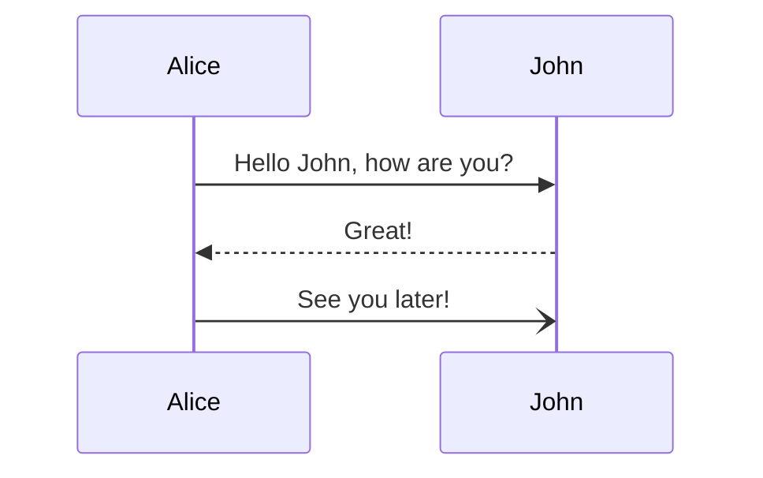

# CI-CD_demo
Demo for demonstration functional CI\CD process

* Run test
* Build image use doker
* Push to GitHub registri

[An Internal Link](https://docs.github.com/en/get-started/writing-on-github/working-with-advanced-formatting/creating-diagrams)
