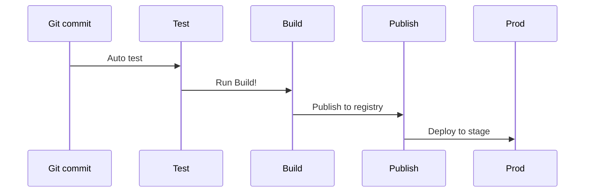

## CI-CD_demo
Demo for demonstration functional CI\CD process

* Run test
* Build image use doker
* Push to GitHub registri

```mermaid
sequenceDiagram
    Git commit->>Test: Auto test
    Test->>Build: Run Build!
    Build->>Publish: Publish to registry
    Publish->>Prod: Deploy to stage
```

